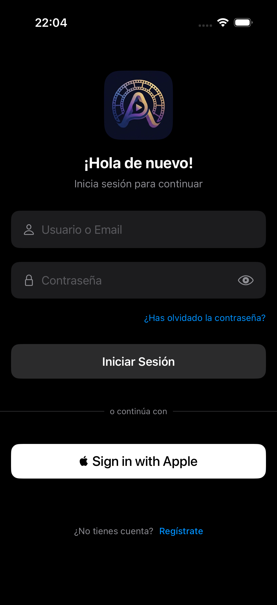
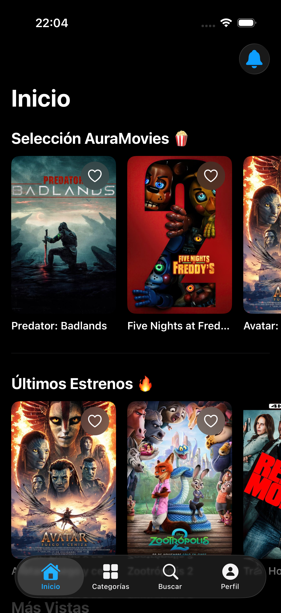
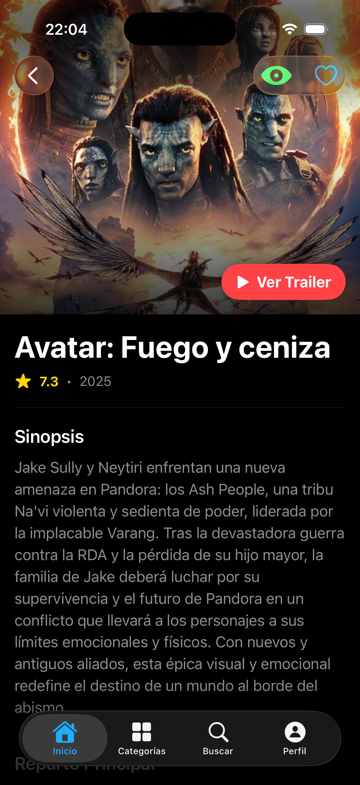
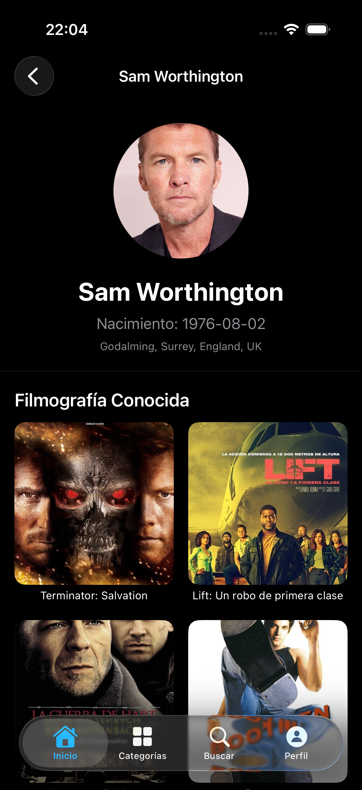
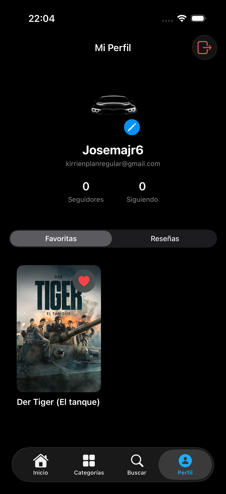
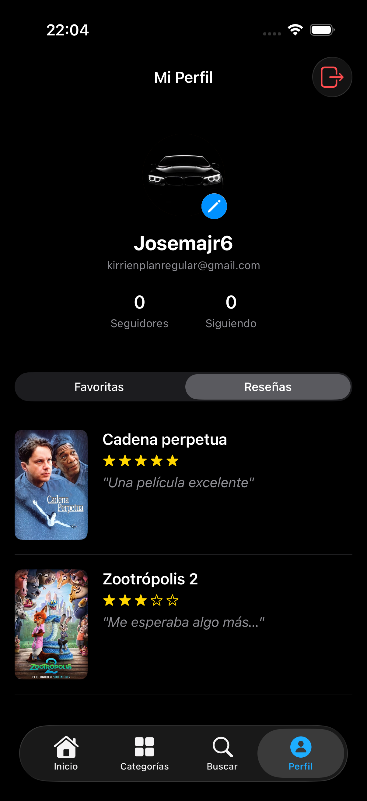
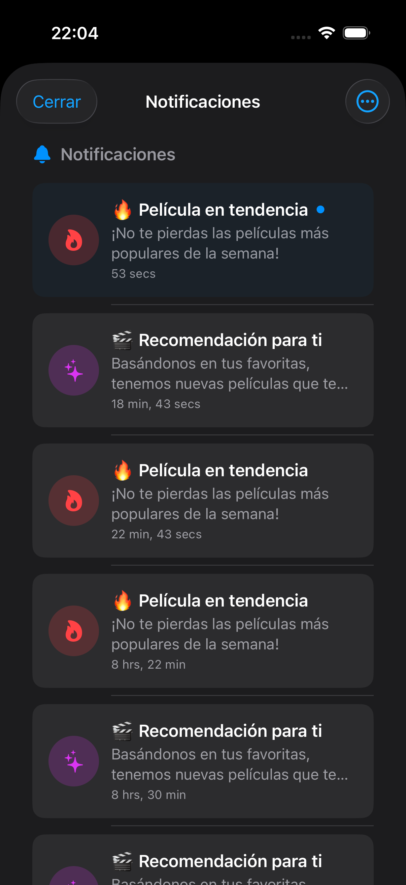
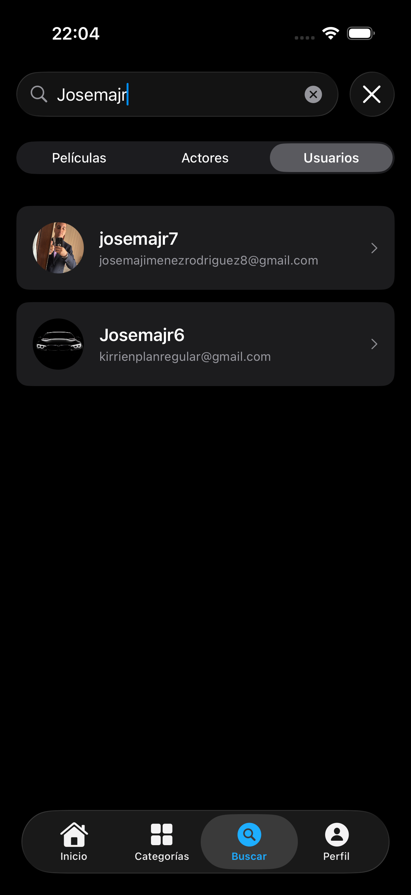
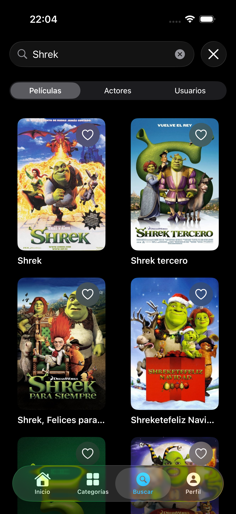
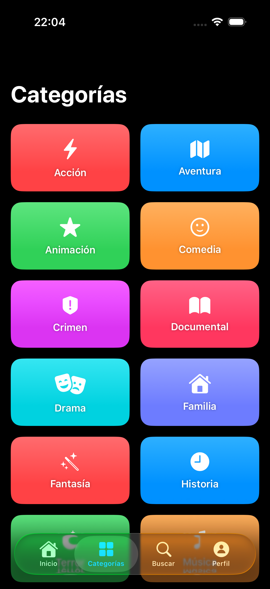

# 🎬 AuraMovies

<p align="center">
  
  <br>
  <b>Tu compañero cinematográfico definitivo para iOS 🍿</b>
</p>

<p align="center">
  
  
  
  
  
</p>

**AuraMovies** es una red social cinematográfica para iOS donde puedes **descubrir películas**, **escribir reseñas**, **seguir a otros cinéfilos** y recibir **notificaciones en tiempo real** sobre tu actividad. Conecta con la comunidad, comparte tus opiniones y nunca te pierdas un estreno.

---

## 📸 Capturas de Pantalla

### 🔐 Autenticación y Exploración

<table>
  <tr>
    <td align="center" width="25%">
      <br/>
      <b>Login</b><br/>
      <sub>Autenticación con email/usuario</sub>
    </td>
    <td align="center" width="25%">
      <br/>
      <b>Inicio</b><br/>
      <sub>Listas curadas de películas</sub>
    </td>
    <td align="center" width="25%">
      <br/>
      <b>Detalle</b><br/>
      <sub>Info completa + trailer</sub>
    </td>
    <td align="center" width="25%">
      <br/>
      <b>Actor</b><br/>
      <sub>Biografía + filmografía</sub>
    </td>
  </tr>
</table>

### 👤 Perfil y Social

<table>
  <tr>
    <td align="center" width="25%">
      <br/>
      <b>Mi Perfil</b><br/>
      <sub>Favoritas y estadísticas</sub>
    </td>
    <td align="center" width="25%">
      <br/>
      <b>Reseñas</b><br/>
      <sub>Valoraciones con estrellas</sub>
    </td>
    <td align="center" width="25%">
      <br/>
      <b>Notificaciones</b><br/>
      <sub>Push + solicitudes</sub>
    </td>
    <td align="center" width="25%">
      <br/>
      <b>Usuarios</b><br/>
      <sub>Búsqueda de cinéfilos</sub>
    </td>
  </tr>
</table>

### 🔍 Búsqueda y Categorías

<table>
  <tr>
    <td align="center" width="50%">
      <br/>
      <b>Búsqueda</b><br/>
      <sub>Encuentra películas y actores</sub>
    </td>
    <td align="center" width="50%">
      <br/>
      <b>Categorías</b><br/>
      <sub>Explora por géneros</sub>
    </td>
  </tr>
</table>

---

## ✨ ¿Qué hace especial a AuraMovies?

### 🎬 **Explora el Mundo del Cine**
Descubre películas de todas las épocas con listas curadas: estrenos, populares, mejor valoradas y nuestra exclusiva "Selección AuraMovies". Navega desde películas a actores y de vuelta, con información completa de TMDB.

### ⭐ **Escribe y Lee Reseñas**
Valora películas con 1 a 5 estrellas y escribe tu opinión. Lee las reseñas de otros usuarios y descubre qué piensan de tus películas favoritas.

### 🤝 **Conecta con Cinéfilos**
Sigue a otros usuarios, mira sus perfiles y descubre nuevas películas a través de sus gustos. Cuentas públicas y privadas para controlar tu privacidad.

### 🔔 **Notificaciones en Tiempo Real**
Recibe notificaciones push cuando alguien te sigue, acepta tu solicitud o cuando hay películas trending. Todo integrado en una sola vista.

### 🎨 **Diseño Moderno y Fluido**
Interfaz adaptativa con modo oscuro, animaciones suaves y efectos hápticos. Optimizada para todos los modelos de iPhone y iPad.

---

## 🚀 Características Principales

### 🎭 **Descubre Películas**
- 📚 **4 Listas Dinámicas**: Trending, Estrenos, Populares y Top Rated
- 🎬 **Detalles Completos**: Sinopsis, reparto, trailers de YouTube integrados
- 🔍 **Búsqueda Inteligente**: Encuentra películas y actores en tiempo real
- 🎨 **20+ Géneros**: Explora por categorías con iconos únicos
- 🔄 **Navegación Infinita**: Película → Actor → Filmografía → Película

### 👤 **Tu Perfil Cinematográfico**
- ⭐ **Sistema de Reseñas**: Valora de 1-5 estrellas + texto de 280 caracteres
- ❤️ **Películas Favoritas**: Guarda tus películas preferidas
- 👁️ **Historial**: Lleva registro de todo lo que has visto
- 📊 **Estadísticas**: Seguidores, siguiendo, favoritas y películas vistas
- 📱 **Sincronización**: Tus datos seguros en la nube

### 🤝 **Red Social Integrada**
- 👥 **Búsqueda de Usuarios**: Encuentra otros amantes del cine
- ➕ **Seguir/Seguidores**: Sistema completo de conexiones
- 🔒 **Perfiles Privados**: Control total sobre quién ve tu actividad
- 📬 **Solicitudes**: Gestiona solicitudes de seguimiento fácilmente
- 👀 **Ver Perfiles**: Explora gustos de otros usuarios

### 🔔 **Sistema de Notificaciones**
- 📱 **Push Reales**: Recibe notificaciones incluso con la app cerrada
- 🔴 **Badge Inteligente**: Contador de notificaciones + solicitudes
- 📨 **Todo en Una Vista**: Notificaciones y solicitudes juntas
- ✅ **Gestión Rápida**: Acepta/rechaza desde la campana
- 🔄 **Auto-sincronización**: Actualización cada 30 segundos

### 🎨 **Experiencia Premium**
- 🌓 **Modo Oscuro**: Adaptación automática al sistema
- ✨ **Animaciones Fluidas**: Transiciones suaves con hápticos
- 📱 **Responsive**: Optimizado para todos los dispositivos iOS
- 🎯 **Iconos Únicos**: Cada género con su identidad visual
- 💎 **Diseño Moderno**: Gradientes, sombras y glassmorphism

---

## 🛠️ Tecnologías Utilizadas

### **Frontend**
- **SwiftUI** - Framework de UI declarativa de Apple
- **Swift 5.9+** - Lenguaje moderno y seguro
- **MVVM + @Observable** - Arquitectura reactiva
- **async/await** - Concurrencia nativa de Swift

### **Backend**
- **Vapor** - Framework web de Swift
- **MongoDB** - Base de datos NoSQL flexible
- **JWT** - Autenticación segura con tokens
- **APNs** - Notificaciones push de Apple

### **APIs**
- **TMDB** - Base de datos de películas
- **Gmail SMTP** - Envío de emails de verificación
- **Apple Services** - Sign in with Apple + Notificaciones

---

## 📦 Instalación

### **Requisitos Previos**

Antes de empezar, asegúrate de tener instalado:

- 💻 **macOS 13+** (Ventura o superior)
- 🔨 **Xcode 15+** ([Descargar](https://developer.apple.com/xcode/))
- 🍃 **MongoDB 6.0+** (veremos cómo instalarlo)
- 📧 **Cuenta de Gmail** (para emails de verificación)

---

### **Paso 1: Descargar el Proyecto**

```bash
# Clonar repositorio
git clone https://github.com/tu-usuario/aura-movies.git
cd aura-movies
```

---

### **Paso 2: Instalar MongoDB**

MongoDB es la base de datos que almacena usuarios, películas y notificaciones.

#### **En macOS (Recomendado)**

```bash
# 1. Instalar Homebrew si no lo tienes
/bin/bash -c "$(curl -fsSL https://raw.githubusercontent.com/Homebrew/install/HEAD/install.sh)"

# 2. Añadir el repositorio de MongoDB
brew tap mongodb/brew

# 3. Instalar MongoDB Community Edition
brew install mongodb-community@6.0

# 4. Iniciar MongoDB automáticamente
brew services start mongodb-community@6.0

# 5. Verificar que funciona
mongosh
```

En la consola de MongoDB (mongosh):
```javascript
// Ver bases de datos
show dbs

// Salir
exit
```

#### **Comandos Útiles**

```bash
# Ver estado de MongoDB
brew services list | grep mongodb

# Detener MongoDB
brew services stop mongodb-community

# Reiniciar MongoDB
brew services restart mongodb-community
```

---

### **Paso 3: Configurar Gmail**

Para enviar códigos de verificación, necesitas una **Contraseña de Aplicación** de Gmail.

#### **Obtener Contraseña de Aplicación**

1. 🌐 Entra a [myaccount.google.com](https://myaccount.google.com/)
2. 🔐 Ve a **Seguridad** → **Verificación en dos pasos**
3. ✅ Actívala si no la tienes (sigue las instrucciones)
4. 🔑 Busca **Contraseñas de aplicación**
5. ➕ Crea una nueva:
   - App: **Correo**
   - Dispositivo: **Otro** → "AuraMovies"
6. 📋 Copia la contraseña (16 caracteres)

> ⚠️ **Importante**: Usa esta contraseña, NO tu contraseña normal de Gmail.

---

### **Paso 4: Configurar el Backend**

Edita el archivo `Backend/.env` con tus datos:

```env
# MongoDB (no cambiar si usaste Homebrew)
MONGO_HOST=localhost
MONGO_PORT=27017
MONGO_DATABASE=auramovies_db

# Puerto del servidor
PORT=8080

# Tu Gmail y contraseña de aplicación
SMTP_EMAIL=tu-correo@gmail.com
SMTP_PASSWORD=tu contraseña de aplicación aquí

# API Key de TMDB (necesitas obtener una gratis)
TMDB_API_KEY=tu_api_key_aqui
```

#### **Obtener API Key de TMDB (Gratis)**

1. 🌐 Ve a [themoviedb.org](https://www.themoviedb.org/)
2. 📝 Crea una cuenta gratuita
3. ⚙️ Ve a **Configuración** → **API**
4. 📋 Solicita una API Key (aprobación instantánea)
5. 📄 Copia la **API Key (v3 auth)**

---

### **Paso 5: Configurar la App iOS**

Crea el archivo `App/AuraMovies/App/Config.xcconfig`:

```text
TMDB_API_KEY = tu_api_key_de_tmdb_aqui
```

---

### **Paso 6: Iniciar el Backend**

```bash
# Ve a la carpeta del backend
cd Backend

# Compila (primera vez puede tardar)
swift build

# Inicia el servidor
swift run
```

**✅ Deberías ver esto:**

```
🔗 Conectando a MongoDB: mongodb://localhost:27017/auramovies_db
✅ Migraciones completadas
🚀 Servidor iniciado en http://localhost:8080
```

> ⚠️ **Mantén esta terminal abierta** mientras uses la app.

---

### **Paso 7: Ejecutar la App**

```bash
# Abre otra terminal y ve a la carpeta de la app
cd App

# Abre Xcode
open AuraMovies.xcodeproj
```

**En Xcode:**

1. 📱 Selecciona un simulador (iPhone 15 Pro recomendado)
2. ▶️ Presiona **⌘ + R** para ejecutar
3. 🔔 Permite las notificaciones cuando te lo pida
4. 🎉 ¡Listo!

---

### **Paso 8: Crear tu Cuenta**

1. 📝 Toca **"Regístrate"** en la app
2. 👤 Completa:
   - Usuario (mínimo 3 caracteres)
   - Email válido
   - Contraseña (mínimo 8 caracteres)
3. 📧 Revisa tu email para el código de 6 dígitos
4. ✅ Introdúcelo en la app
5. 🎬 ¡Empieza a explorar!

---

## 🎯 Guía de Uso

### **Explorar Películas**

1. 🏠 **Inicio**: Desliza por las listas curadas
2. 🎬 **Detalle**: Toca cualquier película para ver:
   - Sinopsis completa
   - Reparto (toca un actor para ver su filmografía)
   - Trailer de YouTube
   - Películas similares
3. ⭐ **Valorar**: Toca el ojo 👁️ para escribir tu reseña

### **Sistema Social**

#### **Buscar Usuarios**
1. 🔍 Ve a **Buscar** → Cambia a **"Usuarios"**
2. ✍️ Escribe el nombre de quien buscas
3. 👤 Toca un perfil para verlo

#### **Seguir a Alguien**
- **Cuenta Pública**: Toca **"Seguir"** → Instantáneo
- **Cuenta Privada**: Toca **"Solicitar"** → Espera aprobación

#### **Gestionar Solicitudes**
1. 🔔 Abre la **Campana** (esquina superior derecha)
2. 📬 Verás las solicitudes en la parte superior
3. ✅ **Acepta** o ❌ **Rechaza** con un toque

### **Tu Perfil**

- ❤️ **Favoritas**: Guarda películas con el corazón
- ⭐ **Reseñas**: Ve todas tus valoraciones con estrellas y textos
- 👥 **Seguidores/Siguiendo**: Gestiona tus conexiones
- ⚙️ **Editar Perfil**: 
  - Cambiar nombre/email (límite 14 días)
  - Subir foto de perfil
  - Cambiar contraseña
  - Activar cuenta privada

---

## 🔧 Solución de Problemas

### **El backend no inicia**

```bash
# Verifica que MongoDB esté corriendo
brew services list | grep mongodb

# Si no está activo, inícialo
brew services start mongodb-community
```

### **No llegan emails de verificación**

- ✅ Verifica que usaste la **Contraseña de Aplicación** (no tu contraseña normal)
- ✅ Comprueba el archivo `.env` en `Backend/`
- ✅ Revisa la carpeta de Spam en tu email

### **La app no se conecta al backend**

- ✅ Asegúrate de que el backend esté corriendo (Paso 6)
- ✅ Verifica que use `http://127.0.0.1:8080` en el código
- ✅ Si usas iPhone físico, cambia a tu IP local

### **Error al compilar en Xcode**

```bash
# Limpia el build
⌘ + Shift + K

# Borra DerivedData
rm -rf ~/Library/Developer/Xcode/DerivedData

# Vuelve a compilar
⌘ + R
```

---

## 📖 Funcionalidades Avanzadas

### **Notificaciones Push**

Las notificaciones funcionan en simulador (locales) y en dispositivo real (push reales vía APNs).

**En Simulador:**
- ✅ Verás banners cuando la app esté abierta

**En Dispositivo Real:**
- ✅ Notificaciones incluso con la app cerrada
- 🔐 Requiere configurar certificado APNs (avanzado)

### **Cuenta Privada**

1. ⚙️ Ve a **Perfil** → **Editar**
2. 🔒 Activa **"Cuenta Privada"**
3. 📬 Ahora recibirás solicitudes en vez de seguidores automáticos

### **Sincronización**

Todos tus datos se guardan:
- 📱 **Localmente**: En tu dispositivo (favoritas, vistas)
- ☁️ **En la nube**: En MongoDB (reseñas, seguidores)

---

## 🌟 Próximas Funcionalidades

- [ ] 💬 Comentarios en películas
- [ ] 📱 Widget de iOS
- [ ] 🎯 Recomendaciones personalizadas con IA
- [ ] 🎬 Listas personalizadas de películas
- [ ] 🔗 Compartir películas en redes sociales
- [ ] 📺 Integración con servicios de streaming

---

## 🤝 Contribuir

¿Quieres mejorar AuraMovies? ¡Las contribuciones son bienvenidas!

1. 🍴 Haz un fork del proyecto
2. 🌿 Crea una rama (`git checkout -b feature/nueva-funcion`)
3. 💾 Haz commit (`git commit -m 'Añade nueva función'`)
4. 📤 Push a la rama (`git push origin feature/nueva-funcion`)
5. 🔀 Abre un Pull Request

---

## 📄 Licencia

Este proyecto está bajo la licencia MIT. Ver `LICENSE` para más detalles.

---

## 🙏 Agradecimientos

- 🎬 **TMDB** por su API gratuita de películas
- 💨 **Vapor** por el framework de backend
- 🍎 **Apple** por SwiftUI y las herramientas
- 🍃 **MongoDB** por la base de datos
- 👥 **Comunidad de Swift** por el apoyo constante

---

## 📞 Soporte

¿Necesitas ayuda? 

1. 📖 Revisa la [Solución de Problemas](#-solución-de-problemas)
2. 🐛 Abre un [Issue](https://github.com/tu-usuario/aura-movies/issues)
3. 📚 Consulta la documentación de [TMDB](https://developers.themoviedb.org/3), [Vapor](https://docs.vapor.codes/) o [MongoDB](https://www.mongodb.com/docs/)

---

<p align="center">
  <b>🍿 ¡Disfruta de AuraMovies y comparte tu pasión por el cine! 🍿</b>
  <br><br>
  
  
  
  <br>
  <b>v2.1 - Red Social Cinematográfica</b>
</p>