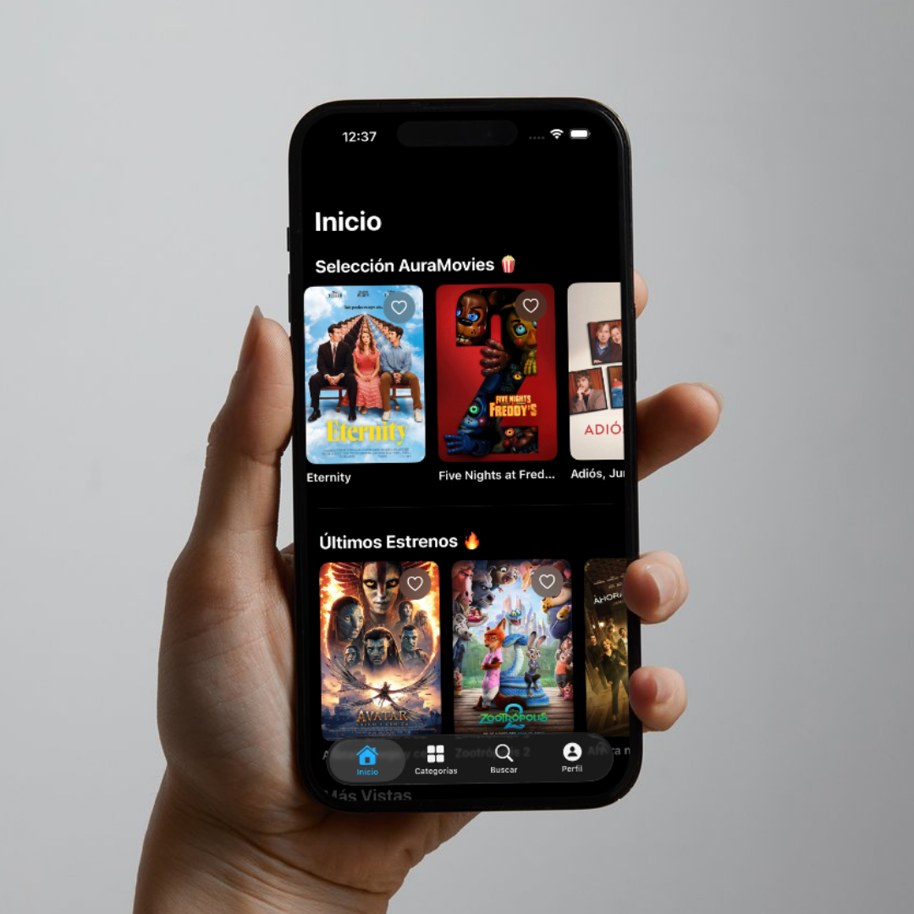
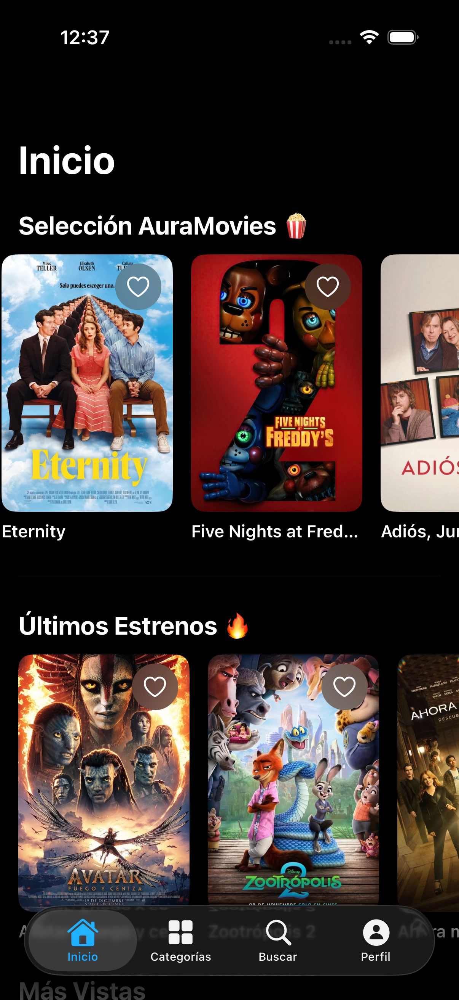
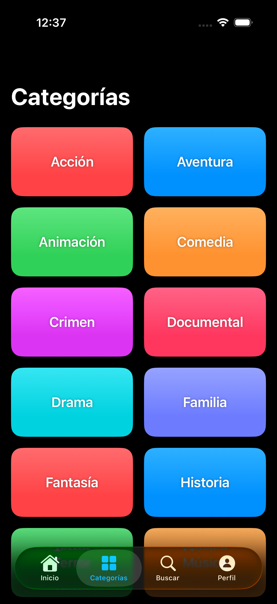
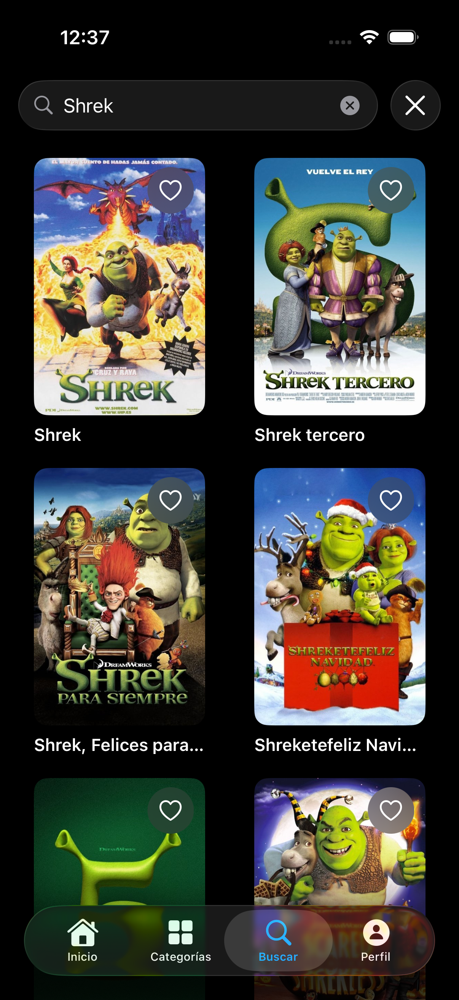
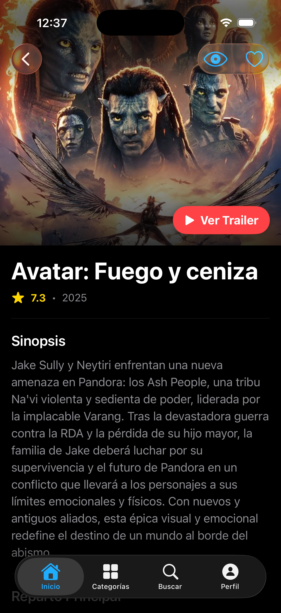
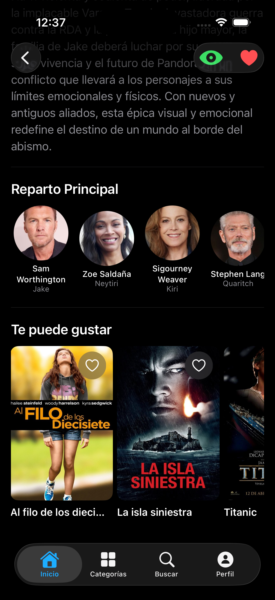
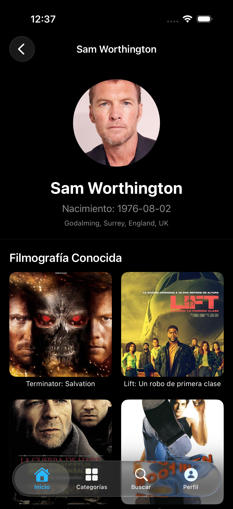
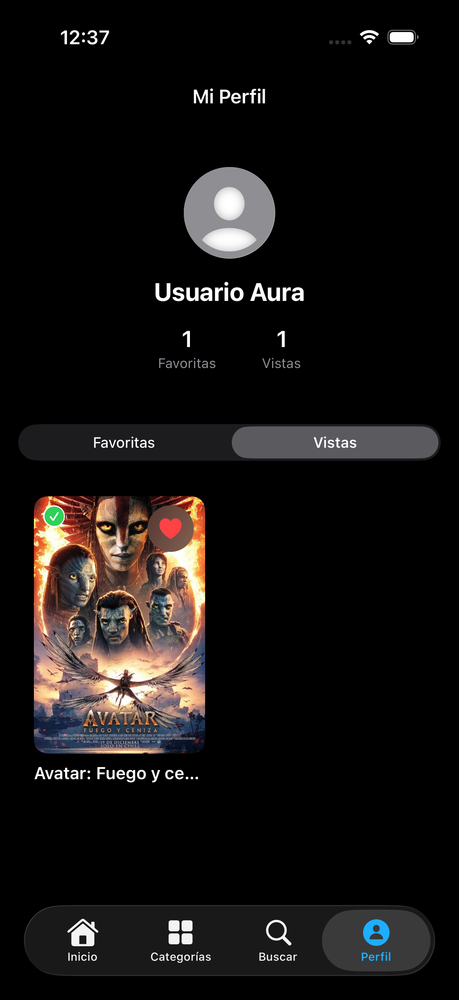

# 🎬 AuraMovies


**AuraMovies** es una aplicación nativa de iOS desarrollada en **SwiftUI** que ofrece una experiencia inmersiva para descubrir películas. Utilizando la API de **TMDB (The Movie Database)**, la app permite navegar de forma "infinita" entre películas, actores y géneros, gestionando además un perfil de usuario persistente.

---

## ✨ Características

* **Exploración Dinámica**: Listas de "Estrenos", "Populares" y la exclusiva "Selección Aura" (Trending).
* **Detalle Profundo**: Sinopsis, puntuación, año, trailers de YouTube integrados y reparto.
* **Navegación Cruzada**: Sistema de navegación recursiva (Película -> Actor -> Filmografía -> Película).
* **Gestión de Perfil**:
    * ❤️ **Favoritos**: Guarda las películas que amas.
    * 👁️ **Vistas**: Historial de películas visualizadas.
    * Persistencia de datos local mediante `UserDefaults`.
* **Búsqueda Inteligente**: Buscador en tiempo real con *debounce* para optimizar llamadas a la API.
* **UI/UX Moderna**: Diseño adaptativo con soporte nativo para **Modo Oscuro**.

---

## 📱 Galería de la App

> Una experiencia visual diseñada para iOS.

### 🌟 Mockup Principal


### 🧭 Navegación y Descubrimiento

| **Inicio (Home)** | **Categorías** | **Buscador** |
|:---:|:---:|:---:|
|  |  |  |
| *Explora tendencias y listas* | *Navega por género* | *Encuentra cualquier título* |

### 🎬 Detalle y Contenido

| **Detalle Película (Top)** | **Detalle (Info & Reparto)** | **Detalle Actor** |
|:---:|:---:|:---:|
|  |  |  |
| *Póster, Trailer y Sinopsis* | *Actores y Recomendaciones* | *Bio y Filmografía completa* |

### 👤 Usuario

| **Perfil de Usuario** |
|:---:|
|  |
| *Tus listas de Favoritos y Vistas* |

---

## 🛠️ Stack Tecnológico

Este proyecto ha sido construido siguiendo las mejores prácticas de desarrollo moderno en iOS:

* **Lenguaje**: Swift 5.0+
* **Framework UI**: SwiftUI
* **Arquitectura**: MVVM (Model-View-ViewModel)
* **Gestión de Estado**: Framework `Observation` (@Observable) de iOS 17+.
* **Concurrencia**: Swift Concurrency (`async/await`) para llamadas asíncronas limpias.
* **Red**: `URLSession` con decodificación `Codable`.
* **Persistencia**: `UserDefaults` con codificación JSON personalizada.
* **API**: [The Movie Database (TMDB)](https://www.themoviedb.org/documentation/api).

---

## 🚀 Instalación y Ejecución

Para correr este proyecto en tu máquina local, sigue estos pasos cuidadosamente, ya que **las claves de API no están incluidas en el repositorio** por seguridad.

1.  **Clona el repositorio**:
    ```bash
    git clone [https://github.com/tu-usuario/AuraMovies.git](https://github.com/tu-usuario/AuraMovies.git)
    cd AuraMovies
    ```

2.  **Abre el proyecto**:
    Abre el archivo `AuraMovies.xcodeproj` en Xcode 15 o superior.

3.  **Configura la API Key (IMPORTANTE)**:
    El proyecto necesita un archivo de configuración que está ignorado en Git.
    * Regístrate en [TMDB](https://www.themoviedb.org/) y obtén tu API Key gratuita.
    * En Xcode, navega a la carpeta `AuraMovies/App/`.
    * Crea un nuevo archivo llamado **`Config.xcconfig`**.
    * Añade la siguiente línea dentro de ese archivo:
        ```text
        TMDB_API_KEY = tu_clave_de_tmdb_aqui
        ```

4.  **Compila y Ejecuta**:
    Selecciona un simulador (ej. iPhone 15 Pro) y pulsa `Cmd + R`.

---

## 🏗️ Arquitectura

El proyecto sigue una estructura modular limpia:

* **App**: Punto de entrada y configuración global.
* **Core**: Servicios de red (`MovieService`), Managers de persistencia (`FavoritesManager`, `HistoryManager`) y constantes.
* **Features**: Módulos funcionales (MoviesList, MovieDetail, etc.). Cada uno contiene:
    * *Models*: Estructuras de datos (`Movie`, `Cast`, `Video`).
    * *ViewModels*: Lógica de negocio y estado (`HomeViewModel`, `SearchViewModel`).
    * *Views*: Interfaz de usuario declarativa.

---

Desarrollado con ❤️ por **José Manuel Jiménez**